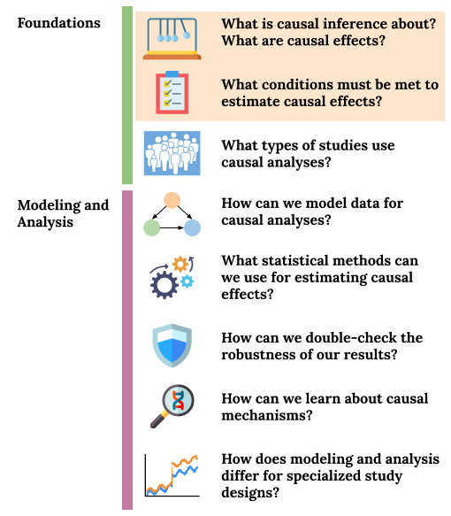

```{r 02_setup, include=FALSE}
knitr::opts_chunk$set(echo=TRUE, eval=FALSE, fig.align="center")
```

# Exchangeability

## Pre-class work {-}

Videos/slides

- Defining Causal Effects: [[video]](https://youtu.be/poSGgCFsHgU), [[slides]](https://drive.google.com/file/d/1q8rrpDSz3TS2t_B6bNZyfOklVdOEtCXW/view?usp=sharing)
- Exchangeability: [[video]](https://youtu.be/WILPl5dkMMQ), [[slides]](https://drive.google.com/file/d/1Tx3Q2khrHzbFWk4cuVFEI1AcStwVxouZ/view?usp=sharing)


Checkpoint questions: [Link to Moodle checkpoint](https://moodle.macalester.edu/mod/quiz/view.php?id=24220)

@. Which of the following is an example of an example of an average causal effect? Select all that apply.
    a. $E[Y^{a=1}]$
    b. $E[Y^{a=0}]$
    c. $E[Y^{a=1}]/E[Y^{a=0}]$
    d. $Y^{a=1}-Y^{a=0}$
    e. $E[Y^{a=1}-Y^{a=0}]$

@. We want to estimate the causal effect of a new medication (treatment group) on cholesterol levels as compared to the medication that is currently the standard of care (control group). (The potential outcomes represent potential cholesterol levels.) Fatty food consumption is likely a factor that would lead to lack of exchangeability of the treated and untreated if doctors use fatty food consumption in their choice of medication to prescribe. Increased fatty food consumption generally leads to higher cholesterol levels. Suppose that the new medication truly does lead to lower cholesterol levels than the standard of care. Which of the following are correct?
    a. If those prescribed the new medication have HIGHER fatty food consumption than those prescribed the standard of care, then the beneficial impact of the new drug will be overestimated when directly comparing the treatment to the control group.
    b. If those prescribed the new medication have HIGHER fatty food consumption than those prescribed the standard of care, then the beneficial impact of the new drug will be underestimated when directly comparing the treatment to the control group.
    c. If those prescribed the new medication have LOWER fatty food consumption than those prescribed the standard of care, then the beneficial impact of the new drug will be overestimated when directly comparing the treatment to the control group.
    d. If those prescribed the new medication have LOWER fatty food consumption than those prescribed the standard of care, then the beneficial impact of the new drug will be underestimated when directly comparing the treatment to the control group.

@. Continuing the medication-cholesterol example, what are two factors (other than fatty food consumption) that could contribute to a lack of exchangeability of the treatment groups? Explain your reasoning.

@. Conditional exchangeability is marginal exchangeability within subsets of the data.
    a. TRUE
    b. FALSE

@. Suppose that marginal exchangeability of the treated and untreated holds. Among the treated, we observe a mean outcome of 10. Among the untreated, we observe a mean outcome of 8. What can be said about $Y^{a=0}$ among the treated and about $Y^{a=1}$ among the untreated?
    a. We don't know anything about those quantities because they are unobserved.
    b. Among the treated, the mean $Y^{a=0}$ is 10. Among the untreated, the mean $Y^{a=1}$ is 8.
    c. Among the treated, the mean $Y^{a=0}$ is 8. Among the untreated, the mean $Y^{a=1}$ is 10.


<br><br><br><br>


## Learning Goals {-}

- Define an **average causal effect** in terms of potential outcomes
- EXCH1: Apply the concepts of marginal and conditional exchangeability to answer questions about (hypothetical) data on potential outcomes.
- EXCH2: Give examples of when marginal and conditional exchangeability would and would not hold in various data contexts.
- EXCH3: Explain why a direct comparison of the outcomes in the treated and untreated is misleading as an estimate of a causal effect.

<center>

</center>

<br><br><br><br>


## Exercises {-}

```{block2, type="solutions"}
**Solutions to these exercises are available [on Moodle](https://moodle.macalester.edu/mod/folder/view.php?id=24167).**
```

```{block2, type="warmup"}
**Navigate to [PollEverywhere](https://www.pollev.com/lesliemyint417) for some warm-up exercises.**
```

<br>

```{block2, type="community"}
If you attended, how was First Thursday for you? Otherwise, what's a Mac tradition that you miss?
```

### Exercise 1 {-}

Suppose that we are trying to understand the causal effect of a personal finance course on the percent of earnings left in savings each month (abbreviated as "percent savings"). For the 500 people who took the course, we are able to collect data on percent savings and various other factors. We are also able to collect the same information from 500 people who did not take the course.

a. Do you think that a comparison of percent savings in the course takers and non-takers would be a valid estimate of the average causal effect? Explain your viewpoint using the concepts of potential outcomes and exchangeability.

b. One important factor to consider is the number of children that an individual has. Explain how this factor could contribute to a lack of exchangeability in the outcomes of the course takers and non-takers. As part of your explanation, discuss how observed outcomes compare to the missing potential outcomes. State any assumptions you make about the relationships between different factors.

c. Do you think conditional exchangeability holds conditional on number of children?    
    - If yes, why?
    - If no, what other factors might be needed to achieve conditional exchangeability? What is your thought process in thinking about other factors?


<br><br>


### Exercise 2 {-}

We have the data below on number of children ($Z$), treatment (course takers: $A = 1$. course non-takers: $A = 0$), and the percent savings outcome ($Y^a$) categorized as either high (H) or low (L).

Assuming that the course takers and non-takers are exchangeable conditional on number of children, estimate the average causal effect $P(Y^{a=1} = \mathrm{high}) - P(Y^{a=0} = \mathrm{high})$.

 $n$   $Z$   $A$   $Y^{a=1}$   $Y^{a=0}$
----- ----- ----- ----------- ------------
 10     2     1     7 H, 3 L        ?
 10     1     1     6 H, 4 L        ?
 10     0     1     5 H, 5 L        ?
 30     2     0         ?      18 H, 12 L
 40     1     0         ?      20 H, 20 L
 50     0     0         ?      20 H, 30 L


<br><br>


### Exercise 3 {-}

While $Y^a$ denotes the potential outcome under treatment $A = a$, $Y$ denotes the observed outcome. (For the treated, $Y = Y^{a=1}$. For the untreated, $Y = Y^{a=0}$.)

Is it possible for marginal exchangeability to hold but for $Y$ and $A$ to be dependent? Explain using a numerical or graphical example.


<br><br>


### Exercise 4 {-}

Assuming that we have exchangeability of the course takers and non-takers conditional on number of children ($Z$) and use of public transportation ($W$), how might a regression model be used to estimate the average causal effect of the personal finance course?


<br><br>


```{block2, type="exittix"}
**Take a few minutes to reflect on today's ideas by filling out an [exit ticket](https://docs.google.com/forms/d/e/1FAIpQLScHlTYLjpItT3XjktsBtJl--CqQ86WnoQS_tWmj8KHoSEzgig/viewform?usp=sf_link).**
```
