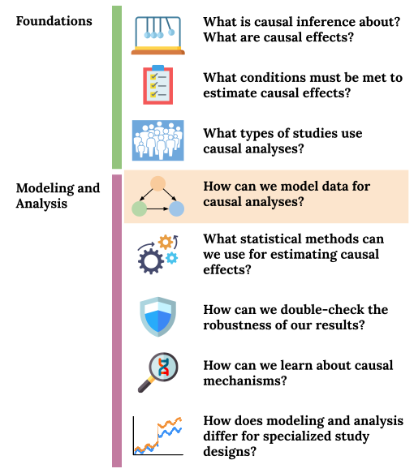

```{r 04_setup, include=FALSE}
knitr::opts_chunk$set(echo=TRUE, eval=FALSE, fig.align="center")
```

# (PART) Causal Graphs {-}

# Causal Graphs as Statistical Models

## Pre-class work {-}

Videos/slides

- Introduction to Causal Graphs: [[video]](https://youtu.be/vU7Vg6yaqmo), [[slides]](https://drive.google.com/file/d/1RowV6uLm2HH3oxZnt6XuiMla-8ZvwWug/view?usp=sharing)
- Causal Graphs as Statistical Models: [[video]](https://youtu.be/GlgQLt6TTZo), [[slides]](https://drive.google.com/file/d/1BfJwctdZcuRm0wCOkrSxfHzZmSf7V4Bc/view?usp=sharing)

Checkpoint questions: [Link to Moodle checkpoint](https://moodle.macalester.edu/mod/quiz/view.php?id=24237)

@. Which of the following graph properties characterize causal graphs?
    a. cyclic
    b. acyclic
    c. directed
    d. undirected
    e. complete

@. For a directed graph with a node X: the parents of X are a subset of the ancestors of X.
    a. TRUE
    b. FALSE

@. Apply the product decomposition rule using the Causal Markov assumption to express the joint distribution of variables in this graph: X --> Y --> Z

@. Apply the product decomposition rule using the Causal Markov assumption to express the joint distribution of variables in this graph: Y <-- X --> Z


<br><br><br><br>


## Learning Goals {-}

- PGRA1: Apply the Causal Markov assumption to express the joint distribution of data.
- Simulate data from causal graphs under linear and logistic regression structural equation models.
- Formulate use cases of simulation to understand causal inference concepts


<center>

</center>

<br><br><br><br>


## Simulating data in R {-}

**You can download a template RMarkdown file to start from [here](template_rmds/04-graphs-models.Rmd).**

### Why simulate? {-}

Simulation is a very powerful tool for understanding statistical ideas. We can simulate (generate) data where we know the true underlying distribution, and we can then see how statistical methods perform on this data. For example:

- Do 95% confidence intervals really contain the true population value in 95% of samples? When is this not true?
- Does regression work to estimate causal effects when we have conditional exchangeability?

<br>

### Simulation functions in R {-}

R has functions to work with several probability distributions. For example, the following 4 functions work with the normal distribution:

- `rnorm()`: Generate a **r**andom number from a normal distribution
- `pnorm()`: Tail **p**robability from a normal distribution
- `dnorm()`: Get **d**ensity value from a normal distribution
- `qnorm()`: Get a **q**uantile from a normal distribution

There are `r`, `p`, `d`, and `q` functions for other distributions too (e.g., `runif()`, `rbinom()`.) We'll primarily use `r` functions to generate random numbers.

**`rbinom()`**:

```{r}
# 4 different people each flip a fair coin once
rbinom(4, size = 1, prob = 0.5)

# 4 different people flip unfair coins
# First 2 flip a coin with P(Heads) = 0.9
# Second 2 flip a coin with P(Heads) = 0.2
rbinom(4, size = 1, prob = c(0.9, 0.9, 0.2, 0.2))

# Write a command with rbinom() so that the result will definitively be 1,0,1

```

**`rnorm()`**:

```{r}
# 5 numbers from a normal distribution with mean 10 and SD 2
rnorm(5, mean = 10, sd = 2)

# 3 numbers from 3 different normal distributions
# Means = 10, 100, 1000. SD = 1
rnorm(3, mean = c(10, 100, 1000), sd = 1)

# Write a command with rnorm() so that the result will definitively be 10,20

```

<br>

### Simulating data from graphs+SEMs {-}

In this course, we'll simulate data that come from graphs and their corresponding structural equation models. We'll step through how to simulate data that come from this causal graph.

```{r 04_dag_example, fig.width=6, fig.height=2, fig.align="center", echo=FALSE, eval=TRUE}
par(mar = rep(0,4))
plot(1, type = "n", xaxt = "n", yaxt = "n", bty = "n", xlab = "", ylab = "", xlim = c(0,6), ylim = c(1,4))
text(c("A", "Z", "Y"), x = c(1,3,5), y = c(1,4,1), cex = 1.1)
arrows(x0 = c(3,3), y0 = c(4,4)-0.2, x1 = c(1,5), y1 = c(1,1)+0.2, angle = 25, lwd = 4)
arrows(x0 = 1.7, y0 = 1, x1 = 4.5, y1 = 1, angle = 25, lwd = 4)
```

**Question:** Using the Causal Markov Assumption, how can we express the joint distribution of this data?

<br>

Consider the structural equation model (SEM) below that is associated with our causal graph:

$$
\begin{align*}
Z &\sim N(\mu_Z = 40, \sigma_Z = 5) \\
A &\sim \mathrm{Binomial}(n = 1, p_A) \\
p_A: &\log\left(\frac{p_A}{1-p_A}\right) = -1 + 0.05Z \\
Y &\sim N(\mu_Y, \sigma_Y = 1) \\
\mu_Y &= 30 + 5A + 2Z
\end{align*}
$$

- $Z$ is an exogenous variable that follows a normal distribution with mean 40 and standard deviation 5.
- $A$ is binary (binomial/Bernoulli) with probability of success $p_A$
    - $p_A$ depends on $Z$ via a logistic regression model.
- $Y$ is quantitative and follows a normal distribution.
    - The mean $\mu_Y$ depends on $A$ and $Z$ via a linear regression model.

<br>

Complete the code below to simulate data that follow this structural equation model.

```{r}
# Sample size
n <- 10000

# Simulate the Z variable
Z <- rnorm(?)

# Simulate the A variable
log_odds_A <- -1 + 0.05*Z
odds_A <- exp(log_odds_A)
p_A <- odds_A/(1+odds_A)
A <- rbinom(?)

# Simulate the Y variable
mean_Y <- 30 + ?
Y <- ?

# Store all simulated variables in a dataset called sim_data
sim_data <- data.frame(Z, A, Y)
```

<br>

### Reproducibility {-}

At the top of code chunks where you perform simulation, use the `set.seed()` function to ensure that when you rerun the code, you get the same results:

```{r}
set.seed(451)
# Your simulation code
```

<br><br><br><br>

## Exercises {-}

```{block2, type="solutions"}
**Solutions to these exercises are available [on Moodle](https://moodle.macalester.edu/mod/folder/view.php?id=28899).**
```

<br>

```{block2, type="community"}
What's something that you enjoyed this long weekend?
```

### Exercise 1 {-}

a. Write the joint distribution of the data from the causal graph below using the Causal Markov Assumption. Then simulate data from the graph. You are free to choose your own structural equation model, but let $Z$, $W$, and $Y$ be quantitative. Let $A$ be binary. Use a sample size of 10,000 for your simulation.

    ```{r 04_ex1, echo=FALSE, eval=TRUE, fig.height=4, fig.align="center"}
    library(dagitty)
    dag <- dagitty("dag {
    bb=\"0,0,1,1\"
    A [exposure,pos=\"0.311,0.400\"]
    W [pos=\"0.541,0.200\"]
    Y [outcome,pos=\"0.640,0.400\"]
    Z [pos=\"0.398,0.200\"]
    A -> Y
    W -> A
    W -> Y
    Z -> A
    Z -> Y
    }
    ")
    plot(dag)
    ```

b. Based on the structural equation model you chose, what would you guess is the average causal effect of $A$ on $Y$?

c. Let's consider *simulating interventions* using your SEM. If you were to force all study units to receive a certain value of treatment (either 0 or 1), how do you think the causal graph would change?

d. Modify your simulation to reflect your thoughts from part c. Incorporate the code below into your simulation. 

    ```{r}
    # Scenario 1: Force all to be treated
    A_force_1 <- rep(1, n) # Repeat the number 1 n times
    # Scenario 2: Force all to be treated
    A_force_0 <- rep(0, n) # Repeat the number 0 n times

    # The treated potential outcome Y^{a=1}
    Y1 <- ? # something with A_force_1
    # The untreated potential outcome Y^{a=0}
    Y0 <- ? # something with A_force_0

    # Estimate the average causal effect
    mean(?)
    ```

e. Was your intuition from part b close to the ACE that you estimated in the simulation?


<br><br>


### Interrupted times series in the news {-}

If you have time, discuss the Tweet below with your group.

- What does Liz Stuart mean by a "stark effect"? What might the trends look like if the effect weren't so stark?
- What is the treatment? What evidence does this analysis provide? Is it strong evidence? Do you have any concerns?

<center>
<blockquote class="twitter-tweet"><p lang="en" dir="ltr">Wow this is a pretty compelling comparative interrupted time series graph. Don&#39;t usually see such a stark effect. <a href="https://t.co/VCPLwUrXby">https://t.co/VCPLwUrXby</a></p>&mdash; Elizabeth Stuart (@Lizstuartdc) <a href="https://twitter.com/Lizstuartdc/status/1302604052753244161?ref_src=twsrc%5Etfw">September 6, 2020</a></blockquote> <script async src="https://platform.twitter.com/widgets.js" charset="utf-8"></script>
</center>

<br><br>


```{block2, type="exittix"}
**Take a few minutes to reflect on today's ideas by filling out an [exit ticket](https://docs.google.com/forms/d/e/1FAIpQLScHlTYLjpItT3XjktsBtJl--CqQ86WnoQS_tWmj8KHoSEzgig/viewform?usp=sf_link).**
```
