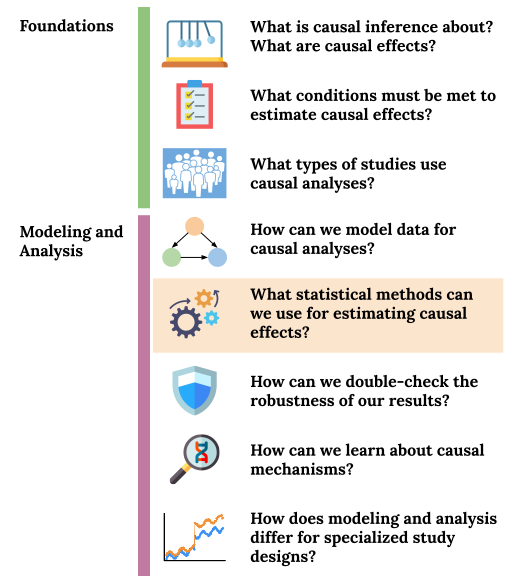
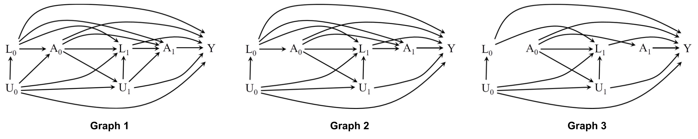

```{r 13_setup, include=FALSE}
knitr::opts_chunk$set(echo=TRUE, eval=FALSE, fig.align="center")
```

# Time-Varying Treatments

## Pre-class work {-}

Required reading

- WHATIF: 19.1 - 19.4

[Checkpoint](https://moodle.macalester.edu/mod/quiz/view.php?id=31376)


<br><br><br><br>


## Learning Goals {-}

- **`TVTR1`**: Formulate research questions that can be answered in a time-varying treatment setting
- **`TVTR2`**: Explain why regression does not generally work in time-varying settings with treatment-confounder feedback using d-separation ideas

<center>

</center>


<br><br><br><br>


## Exercises {-}

```{block2, type="solutions"}
**Solutions to these exercises are available [on Moodle](https://moodle.macalester.edu/mod/folder/view.php?id=34207).**
```

<br>

### Exercise 1 {-}

<center>
    
</center>

Which of these graphs could represent a sequentially randomized experiment and why?

(Graphs that could represent sequentially randomized experiments indicate the presence of *sequential* exchangeability.)

<br><br>

### Exercise 2 {-}

**Treatment-confounder feedback** is the situation where past treatment $A_{t-1}$ affects the value of future confounders $L_{t}$.

The graph below represents the fundamental part of Graph 2 from Exercise 1 that allows us to explore the impact of treatment-confounder feedback.

```{r 13_ex1, echo=FALSE, eval=TRUE, fig.width=11, fig.align="center"}
library(dagitty)
dag <- dagitty("dag {
bb=\"0,0,1,1\"
\"\" [pos=\"0.099,0.096\"]
A0 [pos=\"0.135,0.400\"]
A1 [pos=\"0.472,0.400\"]
L1 [pos=\"0.300,0.400\"]
U1 [pos=\"0.300,0.565\"]
Y [pos=\"0.691,0.400\"]
A0 -> A1 [pos=\"0.312,0.266\"]
A0 -> L1
A0 -> Y [pos=\"0.377,0.137\"]
A1 -> Y [pos=\"0.569,0.346\"]
L1 -> A1
U1 -> L1
U1 -> Y
}
")
plot(dag)
```

a. Using d-separation ideas, explain why a regression model of the form $E[Y \mid A_0, A_1, L_1]$ creates a problem for estimating the effect of a treatment strategy for $A_0$ and $A_1$.

b. How would you expect this graph to change under inverse probability weighting? Thus explain why IPW allows us to estimate the effect of a treatment strategy for $A_0$ and $A_1$.

c. More generally, treatment-confounder feedback has been used to describe not only direct connections between past treatment and future confounders, but also any open path between them. Expanding on the graph here, what other structures lead to problems for conditioning-based estimation methods?

