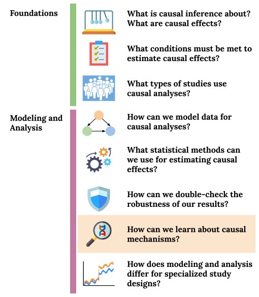
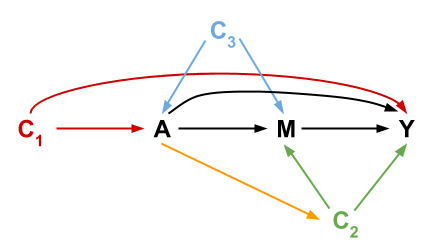

```{r 16_setup, include=FALSE}
knitr::opts_chunk$set(echo=TRUE, eval=FALSE, fig.align="center")
```

# (PART) Mediation Analysis {-}

# Graphical Structure of Mediation

## Pre-class work {-}

Videos/slides

- Mediation Analysis: [[video]](https://youtu.be/wTZ-5zBmwRo), [[slides]](https://drive.google.com/file/d/1xp5usL2pDE8q649z3MoRj1qMh4s5fb8i/view?usp=sharing)

[Checkpoint](https://moodle.macalester.edu/mod/quiz/view.php?id=34662)


<br><br><br><br>


## Learning Goals {-}

- Relate d-separation ideas to exchangeability conditions for mediation
- MEDI1: Formulate research questions that can be answered via mediation analysis

<center>

</center>


<br><br><br><br>


## Exercises {-}

### Background {-}

Consider the following causal diagram representing variables important in mediation analysis:



Let $C = \{C_1, C_2, C_3\}$. When trying to estimate mediation effects (CDE, NDEs, NIEs), the following 4 exchangeability assumptions are necessary:

1. $Y^{am} \perp\!\!\!\perp A \mid C$
2. $Y^{am} \perp\!\!\!\perp M \mid A, C$
3. $M^{a} \perp\!\!\!\perp A \mid C$
4. $Y^{am} \perp\!\!\!\perp M^{a*} \mid C$

<br>

These 4 exchangeability assumptions can be expressed as the following 4 graphical assumptions:

1. No unmeasured confounders of the treatment-outcome relationship ($A$ and $Y$).
2. No unmeasured confounders of the mediator-outcome relationship ($M$ and $Y$).
3. No unmeasured confounders of the treatment-mediator relationship ($A$ and $M$).
4. No confounder of the mediator-outcome relationship is affected by treatment (arrows from $A$ to $C_2$).

When these 4 assumptions hold, the CDE, NDEs, and NIEs can be estimated from data, and we can use models such as the regression models below to estimate them. ($C = \{C_1, C_2, C_3\}$)

$$ E[Y\mid A, M, C] = \theta_0 + \theta_1 A + \theta_2 M + \theta_3 AM + \mathbf{\theta_4'C} $$
$$ E[M\mid A, C] = \beta_0 + \beta_1 A + \mathbf{\beta_2'C} $$


<br><br>

### Exercise 1 {-}

Assumptions 1 and 2 are needed in order to estimate the controlled direct effect (CDE). 

Using d-separation ideas, argue why Assumptions 1 and 2 must hold but why it is not necessary for Assumptions 3 and 4 to hold. Use the paths below from $A$ to $Y$ in your arguments.

(**Note:** All 4 assumptions must hold to estimate the natural direct and indirect effects. If you finish early, feel free to tackle exploring this graphically by looking at the $M$ to $Y$ and $A$ to $M$ paths below.)

```{r echo=FALSE, message=FALSE, eval=TRUE}
library(igraph)

# Create the edge list
el <- rbind(
    c("C1", "A"),
    c("C1", "Y"),
    c("C3", "A"),
    c("C3", "M"),
    c("A", "Y"),
    c("A", "M"),
    c("M", "Y"),
    c("A", "C2"),
    c("C2", "M"),
    c("C2", "Y")
)
# Create the graph
dag <- graph_from_edgelist(el, directed = TRUE)

# Helper functions for displaying paths
display_paths <- function(g, paths) {
    adj <- as_adjacency_matrix(g)
    for (i in seq_along(paths)) {
        path <- paths[[i]]
        cat("Path ", i, ":   ", sep = "")
        draw_edge(adj_mat = adj, path = path)
    }
}

draw_edge <- function(adj_mat, path) {
    path_ids <- as_ids(path)
    arrow_vec <- rep("", length(path_ids))
    for (i in seq_len(length(path_ids)-1)) {
        node1 <- path_ids[i]
        node2 <- path_ids[i+1]
        if (adj_mat[node1,node2]==1) {
            ## Arrow is 1 -> 2
            arrow_vec[i] <- "->"
        } else {
            ## Arrow is 1 <- 2
            arrow_vec[i] <- "<-"
        }
    }
    path_string <- paste(path_ids, arrow_vec)
    path_string <- paste(path_string, collapse = " ")
    cat(path_string, "\n")
}

display_paths(dag, all_simple_paths(dag, from = "A", to = "Y", mode = "all"))
display_paths(dag, all_simple_paths(dag, from = "A", to = "M", mode = "all"))
display_paths(dag, all_simple_paths(dag, from = "M", to = "Y", mode = "all"))
```


<br><br>


### Exercise 2 {-}

Under the exchangeability assumptions discussed above, we can use models such as the regression models below to estimate the CDE, NDE, and NIE. ($C = \{C_1, C_2, C_3\}$, and $\theta_4, \beta_2$ are vectors of coefficients.) In particular, these models can be used as structural models to simulate the different potential outcomes needed to 

$$ E[Y\mid A, M, C] = \theta_0 + \theta_1 A + \theta_2 M + \theta_3 AM + \theta_4'C $$
$$ E[M\mid A, C] = \beta_0 + \beta_1 A + \beta_2'C $$

Given these models, derive expressions for $CDE(m)$ and $NDE(0)$.


<br><br>


### Exercise 3 {-}

Suppose that we were interested in the effect of a new funding model for police departments on crime rates. What causal questions related to mediation might arise? What effects might be most of interest and why?


