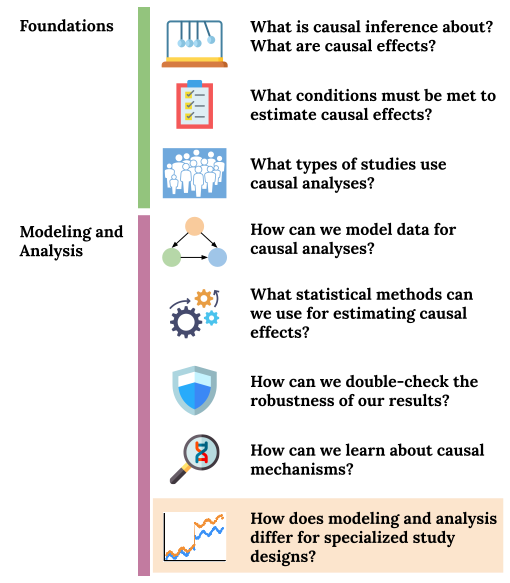

```{r 18_setup, include=FALSE}
knitr::opts_chunk$set(echo=TRUE, eval=FALSE, fig.align="center")
```

# (PART) Specialized Study Designs {-}

# Instrumental Variables Analysis

## Learning Goals {-}

- **`IVAR1`:** Design and evaluate an instrumental variables study in light of the instrumental variables assumptions.
- **`IVAR2`:** Explain how instrument strength and analysis choices affect the results of an instrumental variables analysis

<center>

</center>


<br><br><br><br>


## Exercises {-}

**A template RMarkdown document that you can start from is available [here](template_rmds/18-iv.Rmd).**

<br>

### Exercise 1 {-}

In health services research, the distance that one lives from a specialty care provider is often considered as an instrument. In particular, studies have looked at the causal effect of high-level vs low-level neonatal intensive care units (high vs. low level NICUs) on birth outcomes. (High vs. low is differentiated by the amount of technology available and number of babies delivered per year.)

The instrument used in this setting was a *differential distance (excess travel time)*: travel time to the nearest high-level NICU *minus* travel time to the nearest low-level NICU. This instrument was binarized to be $IV = 1$ if this excess travel time was no more than 10 minutes, and $IV = 0$ otherwise. Distance to these health services is known to be a reflection of where mothers live which, in turn, is often a reflection of socio-economic status indicators.

#### Part a {-}

Evaluate the validity of differential distance as a (conditional) instrument by constructing a causal graph. You should:

- Display the causal graph.

- Identify a conditioning set such that the instrument would be (conditionally) valid. It's fine if this validity is only an approximate validity.

- Evaluate the degree to which each of the 3 core instrumental assumptions (not the homogeneity or monotonicity assumptions) is satisfied. Make connections between d-separation and the graphical versions of these assumptions.

<br>

#### Part b {-}

To whom does the causal effect estimated by IV generalize? Discuss your opinion of this effect: do you think it would be of genuine interest in this setting?


<br><br>


### Exercise 2 {-}

Some analysts have believed that it is possible to perform a hypothesis test to test the exclusion restriction assumption by regressing `Y ~ A + IV`. If they obtain a high p-value for the IV coefficient, that must mean that the exclusion restriction is met. However, even if the exclusion restriction is met, this test will likely not turn result in the correct conclusion.

Explain two things: (1) the intuition behind the `Y ~ A + IV` test and (2) why this test will not give the right result (using graph concepts).


<br><br>


### Exercise 3 {-}

While randomized experiments are the gold standard for causal inference when everything runs perfectly, **noncompliance** can be an issue. Noncompliance occurs when an individual does not comply with the treatment that was randomly assigned.

Explain how instrumental variables estimation could be useful in a setting with noncompliance, and state clearly what causal effect is being estimated with the IV approach.


<br><br>


### Exercise 4 {-}

The **strength** of an instrument refers to its degree of association with the treatment of interest. Strong instruments are highly associated with the treatment, and weak instruments have small associations with the treatment.

A characteristic of instrumental variables estimation is that the causal effect estimate has much higher variance for weak instruments than for strong instruments. By looking at the ratio form of the IV estimator, argue why this would be the case. (This can also be argued via thinking about the two-stage least squares approach if you wish.)


<br><br>


### Extra! {-}

If you have time, work on this exercise. A good faith effort will earn one extra M grade to apply to any objective of your choosing.

**Before looking at the code below,** plan an answer to the following research question with high-level pseudocode (a high-level description of code that you would write).

> **Research question:** How could we write a simulation study to understand the impact of modeling choices on estimated results in IV settings where there are nonlinear relationships between variables in our causal system?


<br><br><br><br>


Now examine the code below which implements an analysis to investigate the above question. Write a paragraph describing what this simulation study is doing and (preliminary) results from the study.

Code notes:

- The `ivpack` package is used to fit the two-stage least squares model. Specifically, you'll want to look up the documentation for the `ivreg()` function.

- `replicate(n, {code})` repeats `{code}` `n` times.

- `I(x^2)` in a model formula instructs R to add a squared version of `x` to the dataset as another predictor.

```{r}
library(ivpack)
library(dplyr)
library(tidyr)
library(ggplot2)

sim_binary <- function(n, log_odds) {
    odds <- exp(log_odds)
    p <- odds/(1+odds)
    rbinom(n, size = 1, prob = p)
}

simulate_and_estimate <- function(n, iv_strength) {
    results <- replicate(100, {
        Z <- rnorm(n, 10, 2)

        log_odds_IV <- -3 + 0.05*Z + 0.005*(Z^2)
        IV <- sim_binary(n, log_odds_IV)

        log_odds_A <- -1 + 0.04*Z + 0.004*(Z^2) + iv_strength*IV
        A <- sim_binary(n, log_odds_A)

        M <- rnorm(n, 4 + 3*IV, 2)
        Y <- rnorm(n, 4 + Z + 5*A + 2*(M^2), 2)

        sim_data <- data.frame(Z, IV, A, M, Y)

        iv_mod <- ivreg(Y ~ A + Z + M|IV + Z + M, data = sim_data)
        iv_mod2 <- ivreg(Y ~ A + Z + I(Z^2) + M + I(M^2)|IV + Z + I(Z^2) + M + I(M^2), data = sim_data)
        c(iv_strength = iv_strength, estim1 = unname(coefficients(iv_mod)["A"]), estim2 = unname(coefficients(iv_mod2)["A"]))
    })
    results %>% t() %>% as_tibble()
}

set.seed(451)
n <- 10000
result1 <- simulate_and_estimate(n, iv_strength = 0.1)
result2 <- simulate_and_estimate(n, iv_strength = 0.4)
result3 <- simulate_and_estimate(n, iv_strength = 0.8)

all_results <- bind_rows(result1, result2, result3)
all_results <- all_results %>%
    pivot_longer(-iv_strength, names_to = "model_type", values_to = "estimate")

ggplot(all_results, aes(x = model_type, y = estimate)) +
    geom_boxplot() +
    facet_grid(~iv_strength) +
    geom_hline(yintercept = 5, col = "red")
ggplot(all_results, aes(x = model_type, y = estimate)) +
    geom_boxplot() +
    facet_grid(~iv_strength) +
    geom_hline(yintercept = 5, col = "red") +
    coord_cartesian(ylim = c(-200,200))
```


